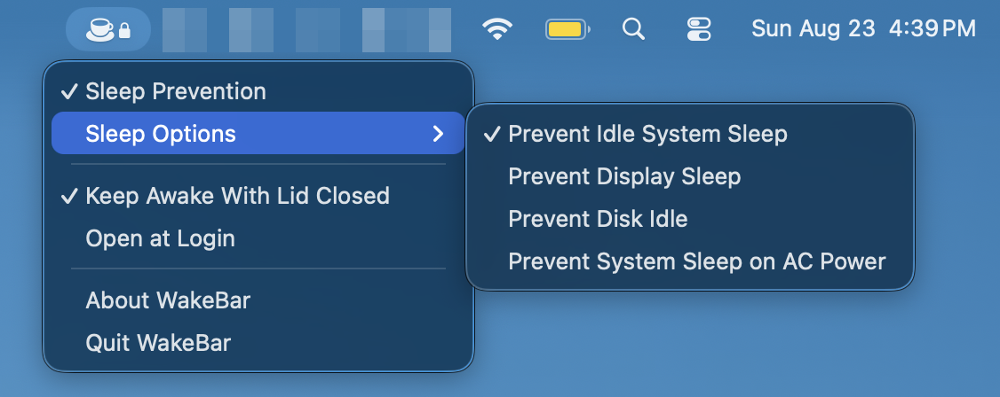

# [WakeBar](https://wakebar.ohrats.party)

Single-file macOS menu-bar utility for keeping your Mac awake. Handy for long-running builds and remote RC sessions.



## Install

```sh
brew install --cask OhRats-Technologies/tap/wakebar
```

Or download it from [GitHub Releases](../../releases/latest).

## Build

Building from source requires the [Xcode Command Line Tools](https://developer.apple.com/documentation/xcode/installing-the-command-line-tools).

```sh
xcrun swiftc -parse-as-library WakeBar.swift -o /tmp/WakeBarBuilder
/tmp/WakeBarBuilder --build --run
```

Requires macOS 14 or later.

Licensed under the [GNU AGPL v3](LICENSE).
